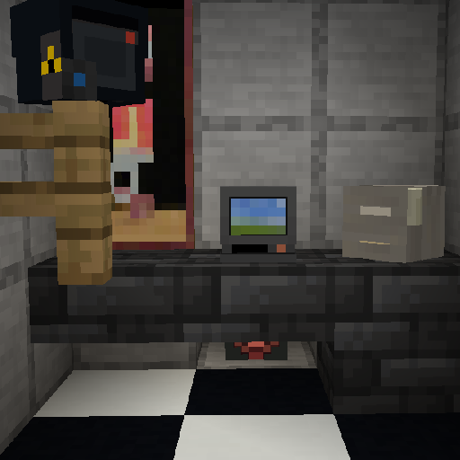

# Sylcurity

Polymer-based security mod.

> [!WARNING]  
> This mod was made in a few days, so don't expect immediate perfection until it's been updated for a while.

# Usage

### For server owners

Simply drop this mod into the `mods` folder and it will work as expected. However, custom textures for the **Event Receiver** (and future textured blocks/items) can be applied by also installing [Polymer](https://modrinth.com/mod/polymer) and configuring [resource pack hosting](https://polymer.pb4.eu/latest/user/resource-pack-hosting/).

The mod should work fine with Geyser players once 1.21.6 is released, though dialogs will be a bit weird due to Bedrock form limitations.

### For players

See the features section below. You'll probably want to start with a **Security Terminal** and an **Activity Log**.

# Features

## Security Terminal

The security terminal, when interacted with, opens a GUI that gives access to cameras on your network. It will emit a `Security Access` event on all groups it is in when opened.

## Activity Log

The activity log keeps track of events on the network (as long as it is in loaded chunks). It will receive events from any group it is in.

## Camera

The camera allows for long-range visual monitoring, though it is only accessible when the chunk it's in is loaded. Only players that are trusted can access the camera, even if they are trusted by the access terminal.

*Bedrock players **will** face issues using them due to differences in spectator mechanics.*

## Player Detector

The player detector works like an invisible tripwire with a range of 32 blocks. They do *not* go through blocks or trusted players (more on that later). They have 16 rotation states and will detect on the angle they are placed at. They emit a `Player Detection` event when a player enters its line of sight that is not trusted, and all groups it is in will receive it.

## Event Receiver

The event receiver will emit a redstone signal when it receives the event it is configured for. It will receive events from any group it is in.

## Mechanics

### Trusted Players

Each device keeps a list of trusted players which can interact with it/be ignored by it. 

### Events/Messages

Currently there are only two events, `Security Access` and `Player Detection`. Devices will send their events to every device in every group they are in, and likewise devices will *receive* messages from any group they are in. (this means if you have two devices both in the same two groups, they will send/receive messages twice)

### Cameras

Players using a camera will be teleported to the camera in a fake "spectator" state while a stand-in NPC takes their place. Players may crouch to exit the camera. When the NPC is damaged, it will kick the player out of the camera and apply the damage as expected. The player is not allowed to interact with any blocks or entities while using the camera, nor can they move their camera. The mod tries its best to prevent any teleportation or state persistence if the server crashes mid-camera-view, but it may happen anyway if the crash is severe enough. *(tl;dr, if the server crashes disgracefully the player may be teleported to the camera they are using.)*